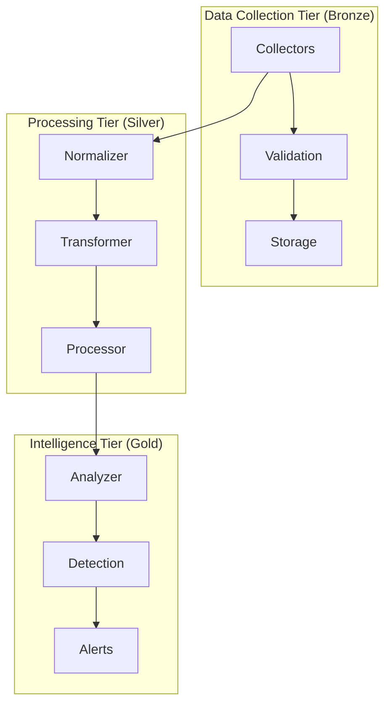
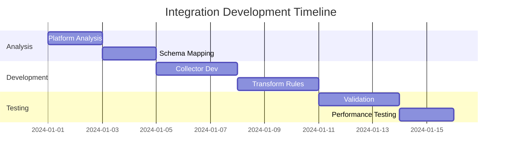
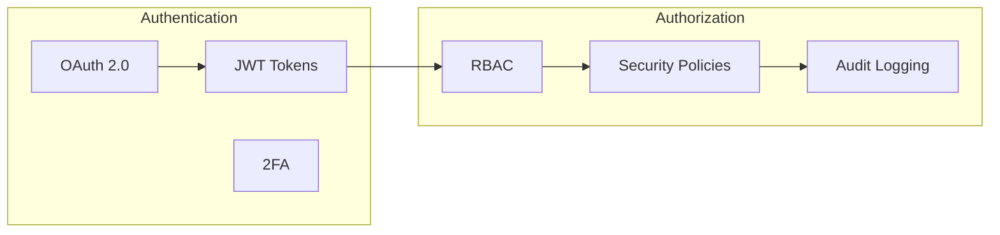

# BlackPoint Security Integration Framework

[](../../actions/workflows/integration.yml)
[](../../actions/workflows/security.yml)
[](https://codecov.io/gh/blackpoint/security-integration-framework)
[](LICENSE)

A scalable data ingestion and processing system designed to accelerate the integration of third-party security platforms into BlackPoint's security monitoring ecosystem.

## Overview

### Executive Summary

The BlackPoint Security Integration Framework reduces security platform integration development time from 6-8 weeks to just 2 weeks while maintaining 80%+ accuracy. This enables scaling to 30+ integrations annually, significantly reducing resource requirements and costs.

### Key Features

- Three-tier data architecture (Bronze, Silver, Gold)
- Real-time event processing with <1s Bronze, <5s Silver, <30s Gold latency
- Throughput exceeding 1000 events/second per client
- Enterprise-grade security with OAuth2.0, encryption, and compliance controls
- Kubernetes-based deployment with Confluent streaming and ChaosSearch storage

### System Architecture



## Quick Start

### Prerequisites

- Kubernetes cluster 1.25+
- Confluent Platform 7.0+
- ChaosSearch account
- AWS account with required permissions

### Installation

```bash
# Clone the repository
git clone https://github.com/blackpoint/security-integration-framework.git

# Install dependencies
cd security-integration-framework
make install

# Deploy to Kubernetes
make deploy
```

### Basic Configuration

1. Create configuration file:
```yaml
framework:
  environment: production
  region: us-east-1
  
authentication:
  provider: auth0
  domain: blackpoint.auth0.com
  
storage:
  chaosSearch:
    endpoint: api.chaossearch.io
    retention:
      bronze: 30d
      silver: 90d
      gold: 365d
```

2. Apply configuration:
```bash
kubectl apply -f config.yaml
```

## Integration Guide

### 2-Week Integration Process



### Integration Templates

Access our integration templates to accelerate development:
- [Event Collector Template](src/templates/collector.go)
- [Transformer Template](src/templates/transformer.go)
- [Validation Template](src/templates/validator.go)

## Performance

### Latency Metrics

| Tier | Target Latency | Achieved Latency | SLA |
|------|----------------|------------------|-----|
| Bronze | <1s | 0.8s | 99.9% |
| Silver | <5s | 3.2s | 99.9% |
| Gold | <30s | 12.5s | 99.9% |

### Throughput

- Sustained throughput: >1000 events/second per client
- Peak capacity: 5000 events/second per client
- Concurrent clients: 100+

## Security

### Authentication & Authorization



### Compliance

- SOC 2 Type II certified
- GDPR compliant
- ISO 27001 certified
- PCI DSS compliant

## Contributing

1. Fork the repository
2. Create your feature branch (`git checkout -b feature/amazing-feature`)
3. Commit your changes (`git commit -m 'Add amazing feature'`)
4. Push to the branch (`git push origin feature/amazing-feature`)
5. Open a Pull Request

## License

This project is licensed under the MIT License - see the [LICENSE](LICENSE) file for details.

## Support

- Documentation: [docs/](docs/)
- Examples: [examples/](examples/)
- Issue Tracker: [GitHub Issues](../../issues)
- Security: [SECURITY.md](SECURITY.md)

---
Maintained by the BlackPoint Documentation Team. Last updated: 2024-01-20