# Technical Specifications

# 1. INTRODUCTION

## 1.1 EXECUTIVE SUMMARY

The BlackPoint Security Integration Framework is a scalable data ingestion and processing system designed to accelerate the integration of third-party security platforms into BlackPoint's security monitoring ecosystem. Currently, each integration requires 6-8 weeks of development time and costs $15-40K, limiting the company's ability to scale beyond 10 integrations annually. This framework will reduce integration development time to 2 weeks while maintaining 80%+ accuracy, enabling scaling to 30+ integrations per year and significantly reducing resource requirements and costs.

The system implements a three-tier data architecture (Bronze, Silver, Gold) deployed on Kubernetes with Confluent streaming and ChaosSearch storage, providing standardized approaches to security data collection, normalization, and intelligence generation while maintaining strict security and compliance standards.

## 1.2 SYSTEM OVERVIEW

### Project Context

| Aspect | Current State | Target State |
|--------|--------------|--------------|
| Integration Development | 6-8 weeks per integration | 2 weeks per integration |
| Annual Integration Capacity | 10 integrations | 30+ integrations |
| Development Cost | $15-40K per integration | Reduced by 60% |
| Parallel Development | 6-8 concurrent integrations | 15+ concurrent integrations |
| Quality Assurance | Manual validation | Automated validation with 80%+ accuracy |

### High-Level Description

The framework consists of three primary architectural tiers:

| Tier | Purpose | Key Capabilities |
|------|---------|-----------------|
| Bronze | Raw Data Storage | Event collection, data preservation, initial validation |
| Silver | Data Processing | Normalization, aggregation, field transformation |
| Gold | Security Intelligence | Threat detection, alert generation, security analysis |

Core Technical Components:
- Kubernetes-based microservices architecture
- Confluent streaming platform for event processing
- ChaosSearch with S3 backing for scalable storage
- REST APIs for integration and data access

## 1.3 SCOPE

### In-Scope Elements

| Category | Components |
|----------|------------|
| Data Collection | - Third-party security platform integration<br>- Real-time event streaming<br>- Batch data processing<br>- API-based data ingestion |
| Data Processing | - Event normalization and standardization<br>- Field transformation and mapping<br>- Data validation and enrichment<br>- Stream processing pipelines |
| Security Intelligence | - Threat detection algorithms<br>- Event correlation<br>- Alert generation<br>- Security analytics |
| Platform Infrastructure | - Kubernetes deployment<br>- Confluent configuration<br>- ChaosSearch integration<br>- API gateway implementation |

### Out-of-Scope Elements

| Category | Excluded Components |
|----------|-------------------|
| User Interface | - Administrative dashboards<br>- Reporting interfaces<br>- Custom visualization tools |
| Security Operations | - Incident response procedures<br>- Security policy management<br>- Threat hunting capabilities |
| Platform Extensions | - Custom reporting engines<br>- Third-party analytics tools<br>- Machine learning models |
| Client Systems | - End-user applications<br>- Client-side processing<br>- Local data storage |

### Success Criteria

| Metric | Target |
|--------|--------|
| Integration Development Time | ≤ 2 weeks per integration |
| Data Processing Latency | Bronze: <1s, Silver: <5s, Gold: <30s |
| System Throughput | >1000 events/second per client |
| Client Scalability | Support 100+ concurrent clients |
| Data Accuracy | ≥80% compared to manual integration |
| Platform Availability | 99.9% uptime excluding maintenance |
| Integration Success Rate | ≥95% successful deployments |

# 2. SYSTEM ARCHITECTURE

## 2.1 High-Level Architecture

```mermaid
C4Context
    title System Context Diagram - BlackPoint Security Integration Framework

    Person(secAnalyst, "Security Analyst", "Monitors security events and investigates threats")
    Person(intDev, "Integration Developer", "Develops and maintains platform integrations")
    
    System_Boundary(sys, "BlackPoint Security Integration Framework") {
        System(collector, "Data Collection Layer", "Ingests security events from multiple platforms")
        System(processor, "Data Processing Layer", "Normalizes and transforms security data")
        System(intelligence, "Intelligence Layer", "Generates security insights and alerts")
    }

    System_Ext(secPlatform, "Security Platforms", "Third-party security tools and systems")
    System_Ext(k8s, "Kubernetes", "Container orchestration platform")
    System_Ext(confluent, "Confluent", "Event streaming platform")
    System_Ext(chaos, "ChaosSearch", "Data storage and analytics")

    Rel(secAnalyst, sys, "Views security data and alerts")
    Rel(intDev, sys, "Develops integrations")
    Rel(secPlatform, collector, "Sends security events")
    Rel(sys, k8s, "Runs on")
    Rel(sys, confluent, "Streams events")
    Rel(sys, chaos, "Stores data")
```

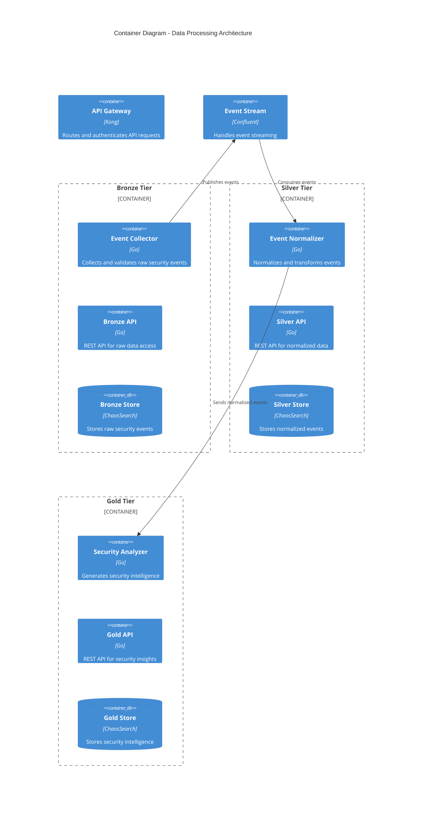

## 2.2 Component Details

### 2.2.1 Data Collection Components

| Component | Purpose | Technology | Scaling | Data Storage |
|-----------|---------|------------|---------|--------------|
| Event Collector | Security event ingestion | Go microservices | Horizontal | In-memory buffer |
| API Gateway | Request routing and auth | Kong | Horizontal | Redis cache |
| Stream Processor | Event streaming | Confluent | Partition-based | Kafka topics |
| Bronze Store | Raw data persistence | ChaosSearch | Storage-based | S3 backing |

### 2.2.2 Data Processing Components

| Component | Purpose | Technology | Scaling | Data Storage |
|-----------|---------|------------|---------|--------------|
| Normalizer | Event standardization | Go microservices | Horizontal | None |
| Aggregator | Event correlation | Go microservices | Horizontal | Redis cache |
| Field Transformer | Data transformation | Go microservices | Horizontal | None |
| Silver Store | Processed data storage | ChaosSearch | Storage-based | S3 backing |

### 2.2.3 Intelligence Components

| Component | Purpose | Technology | Scaling | Data Storage |
|-----------|---------|------------|---------|--------------|
| Security Analyzer | Threat detection | Go microservices | Horizontal | None |
| Alert Generator | Security alerting | Go microservices | Horizontal | Redis cache |
| Intelligence Store | Alert persistence | ChaosSearch | Storage-based | S3 backing |

## 2.3 Technical Decisions

### 2.3.1 Architecture Patterns

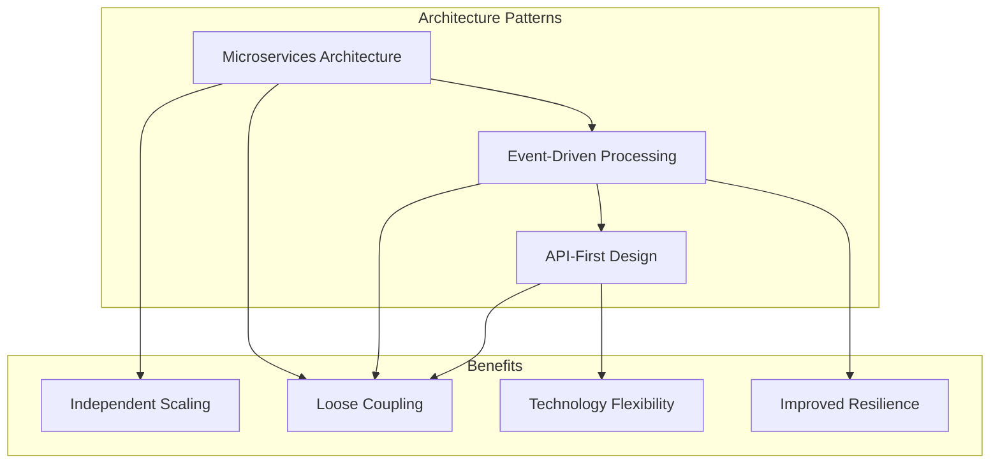

### 2.3.2 Communication Patterns

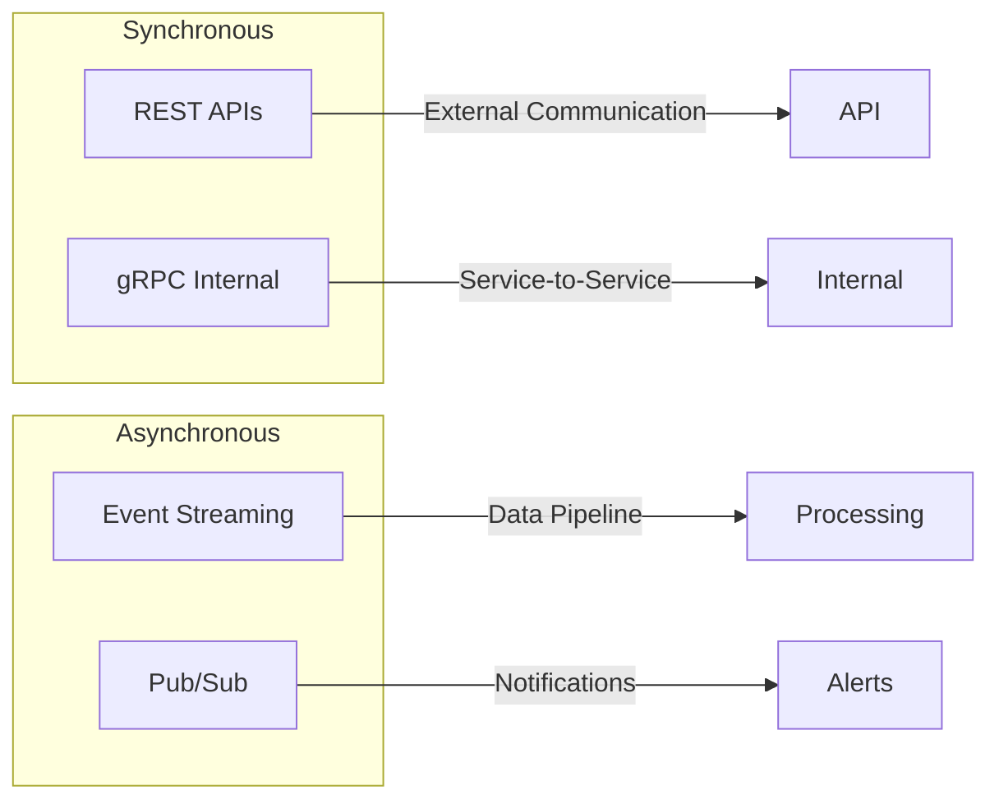

## 2.4 Cross-Cutting Concerns

### 2.4.1 Monitoring Architecture

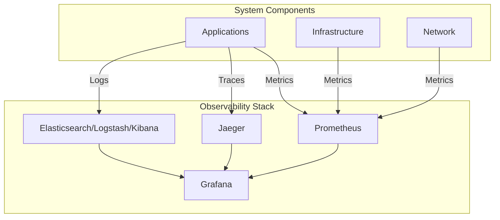

### 2.4.2 Security Architecture

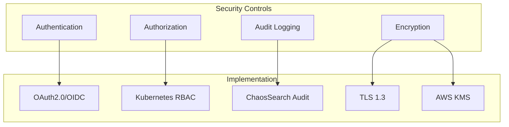

## 2.5 Deployment Architecture

```mermaid
C4Deployment
    title Deployment Diagram - Production Environment

    Deployment_Node(az1, "Availability Zone 1", "AWS") {
        Deployment_Node(k8s1, "Kubernetes Cluster") {
            Container(col1, "Collectors", "Pod")
            Container(proc1, "Processors", "Pod")
            Container(intel1, "Intelligence", "Pod")
        }
    }

    Deployment_Node(az2, "Availability Zone 2", "AWS") {
        Deployment_Node(k8s2, "Kubernetes Cluster") {
            Container(col2, "Collectors", "Pod")
            Container(proc2, "Processors", "Pod")
            Container(intel2, "Intelligence", "Pod")
        }
    }

    Deployment_Node(az3, "Availability Zone 3", "AWS") {
        Deployment_Node(k8s3, "Kubernetes Cluster") {
            Container(col3, "Collectors", "Pod")
            Container(proc3, "Processors", "Pod")
            Container(intel3, "Intelligence", "Pod")
        }
    }

    Deployment_Node(shared, "Shared Services") {
        Container(conf, "Confluent", "Event Streaming")
        Container(chaos, "ChaosSearch", "Data Storage")
        Container(mon, "Monitoring", "Observability")
    }

    Rel(k8s1, shared, "Uses")
    Rel(k8s2, shared, "Uses")
    Rel(k8s3, shared, "Uses")
```

# 3. SYSTEM COMPONENTS ARCHITECTURE

## 3.1 API DESIGN

### 3.1.1 API Architecture

| Component | Specification | Details |
|-----------|--------------|---------|
| Protocol | REST over HTTPS | TLS 1.3 required |
| Authentication | OAuth 2.0 + JWT | Token expiry: 1 hour |
| Authorization | RBAC | Client and role-based |
| Rate Limiting | Token bucket | 1000 req/min per client |
| Versioning | URI-based | /api/v1, /api/v2 |
| Documentation | OpenAPI 3.0 | Auto-generated docs |

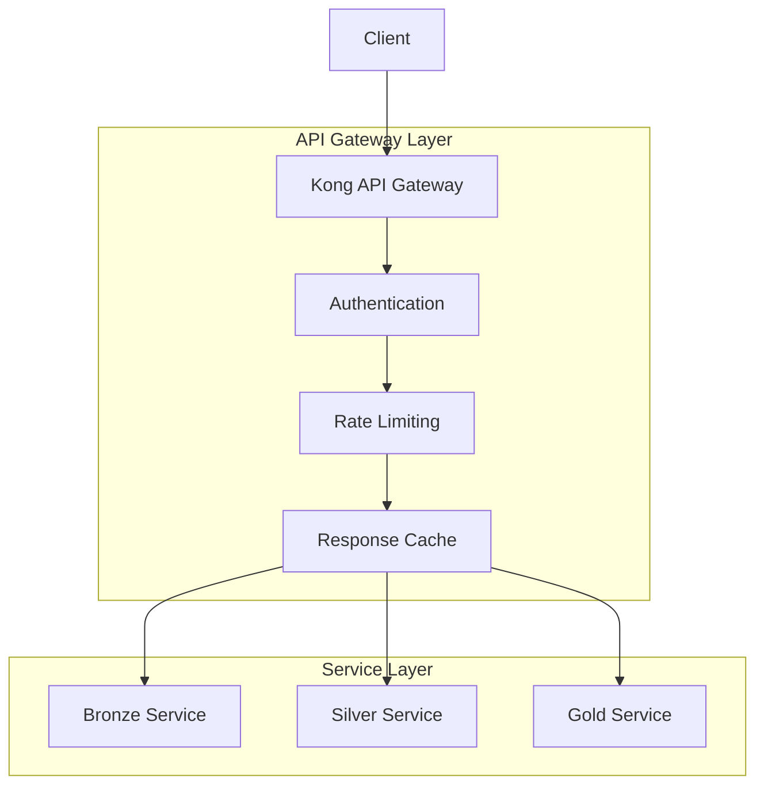

### 3.1.2 Interface Specifications

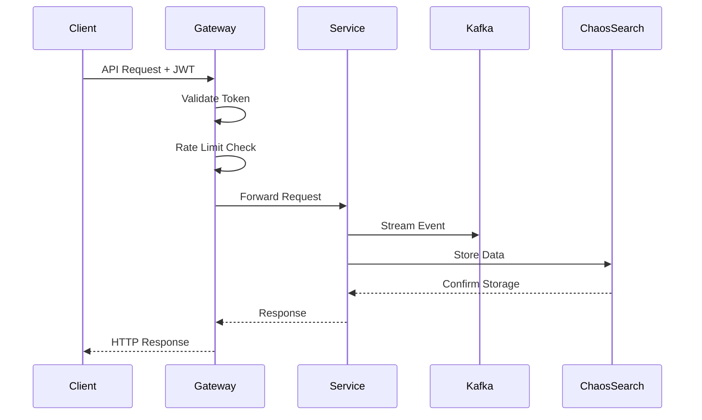

#### Bronze Tier API

```yaml
/api/v1/bronze:
  post:
    summary: Ingest raw security event
    parameters:
      - name: client_id
        in: header
        required: true
    requestBody:
      content:
        application/json:
          schema:
            $ref: '#/components/schemas/RawEvent'
    responses:
      201:
        description: Event accepted
      429:
        description: Rate limit exceeded
```

#### Silver Tier API

```yaml
/api/v1/silver:
  get:
    summary: Query normalized events
    parameters:
      - name: timerange
        in: query
        required: true
      - name: filter
        in: query
        required: false
    responses:
      200:
        description: Normalized events
```

### 3.1.3 Integration Requirements

| System | Integration Method | Requirements |
|--------|-------------------|--------------|
| Security Platforms | REST/Webhook | Rate limiting, retry logic |
| Confluent | Kafka Protocol | SASL authentication |
| ChaosSearch | REST API | IAM authentication |
| Kubernetes | REST API | Service account |

## 3.2 DATABASE DESIGN

### 3.2.1 Schema Design

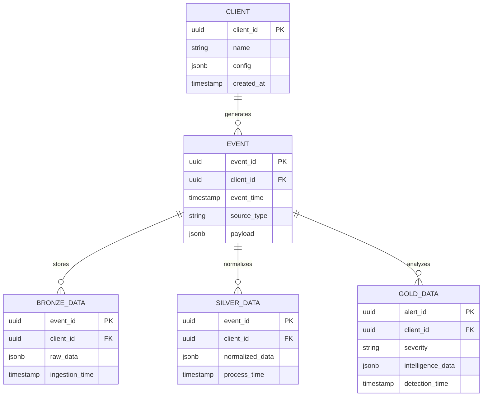

### 3.2.2 Data Management

| Aspect | Strategy | Details |
|--------|----------|---------|
| Partitioning | Time-based | Monthly partitions |
| Retention | Tiered | Bronze: 30d, Silver: 90d, Gold: 365d |
| Archival | S3 Cold Storage | After retention period |
| Backup | Incremental | Daily + Weekly full backup |
| Privacy | Field-level | PII encryption, masking |
| Auditing | Comprehensive | All data access logged |

### 3.2.3 Performance Design

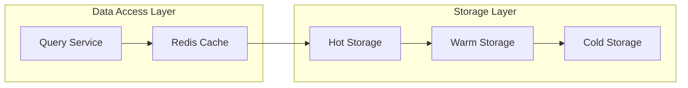

| Component | Strategy | Implementation |
|-----------|----------|----------------|
| Indexing | Multi-level | Time, client_id, event_type |
| Caching | Redis | 15-minute TTL |
| Replication | Cross-AZ | 3 replicas |
| Scaling | Horizontal | Sharding by client_id |
| Recovery | Point-in-time | 7-day recovery window |

## 3.3 CLI DESIGN

### 3.3.1 Command Structure

```bash
blackpoint-cli <command> [subcommand] [options]

Commands:
  configure     Configure CLI settings
  events        Manage security events
  integrations  Manage platform integrations
  status       Check system status
```

### 3.3.2 Interface Specifications

| Command | Options | Description |
|---------|---------|-------------|
| events list | --tier, --timerange | List security events |
| events ingest | --source, --format | Ingest new events |
| integrations deploy | --platform, --config | Deploy new integration |
| status check | --component, --verbose | Check system status |

### 3.3.3 Output Formatting

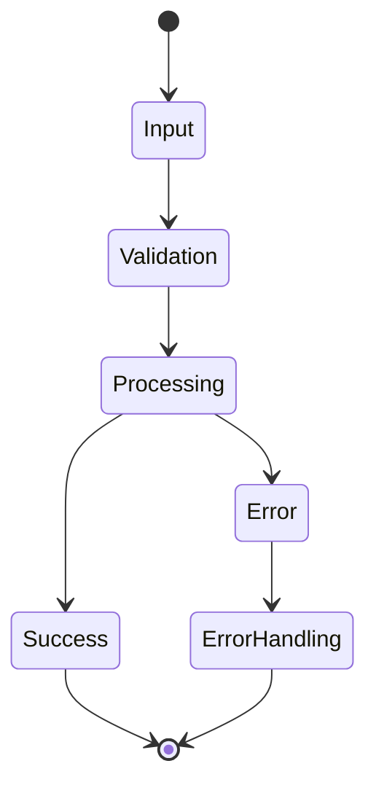

| Output Type | Format | Example |
|------------|--------|---------|
| Success | JSON/Table | Formatted data output |
| Error | Structured | Error code + message |
| Progress | Interactive | Progress bar/spinner |
| Help | Man-style | Command documentation |

# 4. TECHNOLOGY STACK

## 4.1 PROGRAMMING LANGUAGES

| Language | Version | Components | Justification |
|----------|---------|------------|---------------|
| Go | 1.21+ | - Event Collectors<br>- Data Processors<br>- API Services | - High performance for data processing<br>- Excellent concurrency support<br>- Strong typing and compilation safety<br>- Native Kubernetes integration |
| Python | 3.11+ | - Integration Scripts<br>- Data Transformation<br>- Testing Framework | - Rich ecosystem for data processing<br>- Rapid integration development<br>- Extensive security libraries |
| SQL | ANSI | - Data Queries<br>- Analytics | - Standard query language for ChaosSearch<br>- Complex data analysis |

## 4.2 FRAMEWORKS & LIBRARIES

### Core Frameworks

| Framework | Version | Purpose | Justification |
|-----------|---------|---------|---------------|
| Gin | 1.9+ | REST API Framework | - High performance HTTP routing<br>- Middleware support<br>- Built-in validation |
| Confluent-Kafka-Go | 1.9+ | Event Streaming | - Official Confluent client<br>- Native performance<br>- Stream processing support |
| OpenTelemetry | 1.0+ | Observability | - Standard observability framework<br>- Native Kubernetes integration |
| gRPC | 1.50+ | Service Communication | - Efficient service-to-service communication<br>- Strong typing<br>- Bi-directional streaming |

### Supporting Libraries

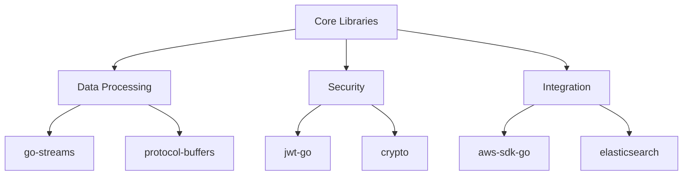

## 4.3 DATABASES & STORAGE

### Primary Storage Solutions

| Component | Technology | Purpose | Configuration |
|-----------|------------|---------|---------------|
| Event Storage | ChaosSearch | Security event data | Multi-AZ, S3 backing |
| Cache | Redis 7.0+ | Data caching | Cluster mode, AOF persistence |
| State Management | etcd 3.5+ | System coordination | HA configuration |
| Queue Storage | Confluent | Event streaming | Multi-broker, rack awareness |

### Data Persistence Strategy

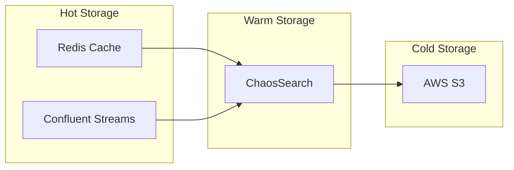

## 4.4 THIRD-PARTY SERVICES

| Service | Purpose | Integration Method | SLA Requirement |
|---------|---------|-------------------|-----------------|
| AWS KMS | Key Management | AWS SDK | 99.999% |
| Confluent Cloud | Event Streaming | Kafka Protocol | 99.95% |
| ChaosSearch | Data Storage/Analytics | REST API | 99.9% |
| Auth0 | Authentication | OAuth2.0 | 99.99% |
| Datadog | Monitoring | API/Agent | 99.9% |

### Service Dependencies

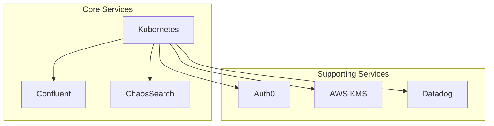

## 4.5 DEVELOPMENT & DEPLOYMENT

### Development Tools

| Category | Tool | Version | Purpose |
|----------|------|---------|----------|
| IDE | GoLand | 2023.2+ | Go development |
| API Testing | Postman | Latest | API validation |
| Profiling | pprof | Latest | Performance analysis |
| Documentation | Swagger | 3.0 | API documentation |

### Deployment Pipeline

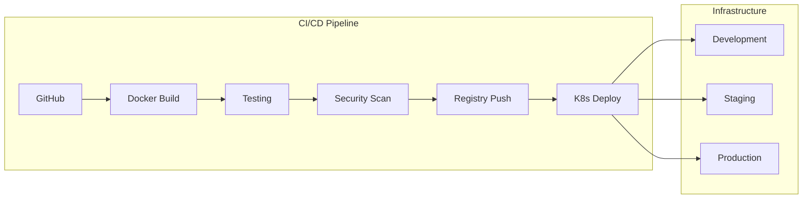

### Container Specifications

| Component | Base Image | Resource Limits | Scaling Strategy |
|-----------|------------|-----------------|------------------|
| Collectors | alpine:3.18 | CPU: 2, Mem: 4Gi | Horizontal |
| Processors | alpine:3.18 | CPU: 4, Mem: 8Gi | Horizontal |
| API Services | alpine:3.18 | CPU: 2, Mem: 4Gi | Horizontal |
| Cache | redis:7.0-alpine | CPU: 2, Mem: 8Gi | Cluster |

### Build Requirements

| Requirement | Tool | Configuration |
|-------------|------|---------------|
| Container Build | Docker | Multi-stage builds |
| Dependency Management | Go Modules | Private registry |
| Security Scanning | Snyk | Critical/High blocks |
| Image Registry | AWS ECR | Immutable tags |
| Config Management | Helm 3 | Environment-based |

# 5. SYSTEM DESIGN

## 5.1 DATABASE DESIGN

### 5.1.1 Data Model

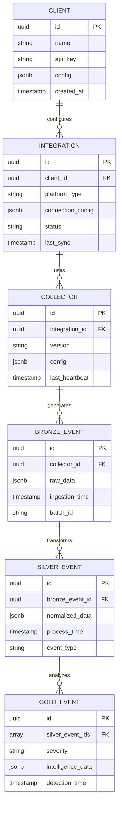

### 5.1.2 Storage Strategy

| Tier | Storage Type | Schema | Retention | Indexing |
|------|--------------|--------|-----------|-----------|
| Bronze | ChaosSearch | Dynamic | 30 days | client_id, timestamp |
| Silver | ChaosSearch | Fixed | 90 days | event_type, client_id |
| Gold | ChaosSearch | Fixed | 365 days | severity, detection_time |

### 5.1.3 Data Access Patterns

| Operation | Access Pattern | Optimization |
|-----------|---------------|--------------|
| Event Ingestion | Write-heavy, sequential | Time-based partitioning |
| Event Processing | Read-write balanced | In-memory processing |
| Intelligence Generation | Read-heavy, analytical | Materialized views |
| Client Queries | Read-heavy, filtered | Client-based sharding |

## 5.2 API DESIGN

### 5.2.1 REST API Structure

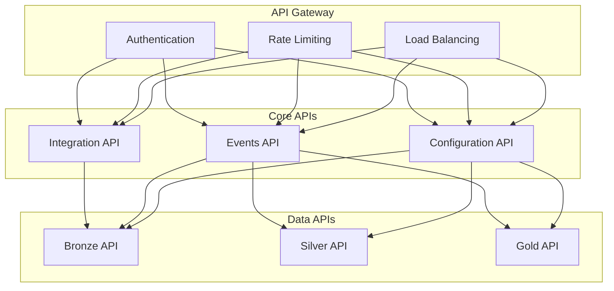

### 5.2.2 API Endpoints

| Endpoint | Method | Purpose | Rate Limit |
|----------|--------|---------|------------|
| /api/v1/integrations | POST | Create integration | 100/hour |
| /api/v1/events/bronze | POST | Ingest raw events | 1000/min |
| /api/v1/events/silver | GET | Query normalized events | 100/min |
| /api/v1/events/gold | GET | Query intelligence | 50/min |
| /api/v1/config | PUT | Update configuration | 10/min |

### 5.2.3 Authentication Flow

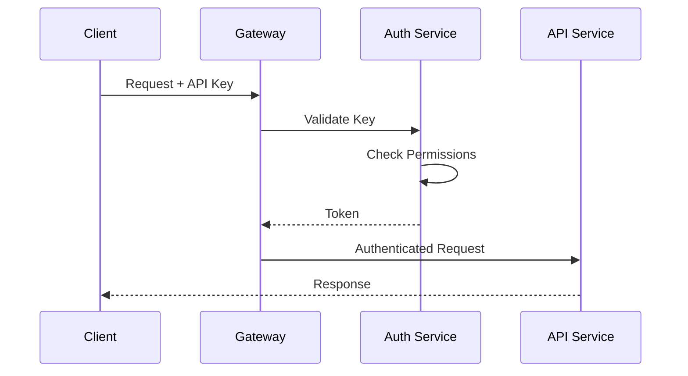

## 5.3 CLI DESIGN

### 5.3.1 Command Structure

```bash
blackpoint-cli <command> [subcommand] [options]

Commands:
  integrate     Manage platform integrations
  collect      Control data collection
  configure    Set system configuration
  monitor      View system status
```

### 5.3.2 Interface Layout

| Command | Options | Example |
|---------|---------|---------|
| integrate new | --platform, --config | `blackpoint-cli integrate new --platform=aws --config=config.yaml` |
| collect start | --integration-id | `blackpoint-cli collect start --integration-id=uuid` |
| configure set | --key, --value | `blackpoint-cli configure set --key=retention --value=30d` |
| monitor status | --component | `blackpoint-cli monitor status --component=collectors` |

### 5.3.3 Output Format

```yaml
# Success Output
status: success
timestamp: "2024-01-20T10:00:00Z"
data:
  id: "uuid"
  status: "running"
  metrics:
    events_processed: 1000
    processing_time: "2.5s"

# Error Output
status: error
timestamp: "2024-01-20T10:00:00Z"
error:
  code: "E1001"
  message: "Integration configuration invalid"
  details: "Missing required field: api_key"
```

## 5.4 SYSTEM INTERACTIONS

### 5.4.1 Component Communication

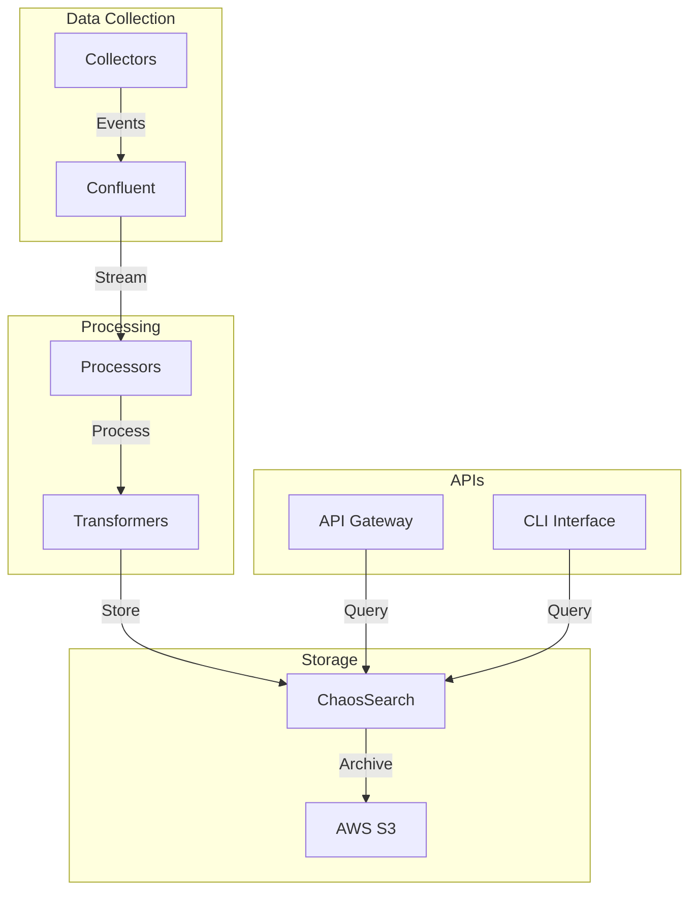

### 5.4.2 Data Flow Patterns

| Pattern | Implementation | Purpose |
|---------|---------------|---------|
| Event Streaming | Confluent Topics | Real-time processing |
| Batch Processing | Scheduled Jobs | Historical analysis |
| Request-Response | REST APIs | Client queries |
| Command-Query | CLI Interface | System management |

### 5.4.3 Error Handling

```mermaid
stateDiagram-v2
    [*] --> Processing
    Processing --> Success
    Processing --> RetryableError
    Processing --> FatalError
    RetryableError --> Retry
    Retry --> Processing
    FatalError --> DeadLetter
    Success --> [*]
    DeadLetter --> [*]
```

# 6. USER INTERFACE DESIGN

Note: While the primary system is API-driven, administrative interfaces are required for integration management and monitoring.

## 6.1 Interface Components Key

```
Icons:
[?] - Help/Documentation
[$] - Billing/Usage Metrics  
[i] - Information
[+] - Add New
[x] - Close/Delete
[<] [>] - Navigation
[^] - Upload Configuration
[#] - Dashboard
[@] - User Profile
[!] - System Alerts
[=] - Settings Menu
[*] - Critical Items

Input Elements:
[ ] - Checkbox
( ) - Radio Button
[Button] - Action Button
[...] - Text Input Field
[====] - Progress Bar
[v] - Dropdown Menu

Borders:
+--+ - Container Border
|  | - Vertical Separator
+-- - Hierarchy/Tree View
```

## 6.2 Integration Management Console

```
+-------------------------------------------------------------------------+
|  BlackPoint Security Integration Framework                    [@] [=] [?]|
+-------------------------------------------------------------------------+
| [#] Dashboard    [*] Integrations    [$] Usage    [!] Alerts            |
+-------------------------------------------------------------------------+
|                                                                         |
|  Integration Management                                    [+ New]      |
|  +-------------------------------------------------------------+      |
|  | Active Integrations (15/30)     [Search...] [Filter v]       |      |
|  | +-----------------------------------------------------------+      |
|  | | Name          | Status  | Events/sec | Last Sync  | Actions|      |
|  | |---------------+---------+------------+-----------+---------|      |
|  | | AWS Security  | [====]  | 856/s      | 2m ago    |[i][x]  |      |
|  | | Azure AD      | [!]     | 0/s        | 15m ago   |[i][x]  |      |
|  | | Okta          | [====]  | 234/s      | 1m ago    |[i][x]  |      |
|  | +-----------------------------------------------------------+      |
|  +-------------------------------------------------------------+      |
|                                                                         |
+-------------------------------------------------------------------------+
```

## 6.3 Integration Configuration

```
+-------------------------------------------------------------------------+
|  Configure Integration                                      [x] Close    |
+-------------------------------------------------------------------------+
|                                                                         |
|  Platform Details                                                       |
|  +-------------------------------------------------------------+      |
|  | Platform Type    [v AWS Security________________________]     |      |
|  | Integration Name [.......................................] [?]|      |
|  | Environment     ( ) Production  ( ) Staging  ( ) Development |      |
|  +-------------------------------------------------------------+      |
|                                                                         |
|  Authentication                                                         |
|  +-------------------------------------------------------------+      |
|  | Auth Type       [v OAuth 2.0_________________________]        |      |
|  | Client ID       [.......................................] [?]|      |
|  | Client Secret   [.......................................] [?]|      |
|  +-------------------------------------------------------------+      |
|                                                                         |
|  Data Collection                                                        |
|  +-------------------------------------------------------------+      |
|  | Collection Mode  ( ) Real-time  ( ) Batch  ( ) Hybrid        |      |
|  | Event Types     [ ] Security Alerts                          |      |
|  |                 [ ] User Activity                            |      |
|  |                 [ ] System Logs                              |      |
|  | Batch Schedule  [v Every 5 minutes__________________]        |      |
|  +-------------------------------------------------------------+      |
|                                                                         |
|  [Test Connection]    [Save Draft]    [Deploy Integration]             |
|                                                                         |
+-------------------------------------------------------------------------+
```

## 6.4 Monitoring Dashboard

```
+-------------------------------------------------------------------------+
|  System Monitoring                                         [@] [=] [?]   |
+-------------------------------------------------------------------------+
|                                                                         |
|  Performance Metrics                        Last Updated: 2 minutes ago |
|  +-------------------------+  +----------------------------------+      |
|  | Events Per Second      |  | Processing Latency               |      |
|  | [====================] |  | Bronze: 0.8s [====]             |      |
|  | 2,345/s               |  | Silver: 3.2s [========]         |      |
|  +-------------------------+  | Gold:   12.5s [============]   |      |
|                              +----------------------------------+      |
|                                                                         |
|  System Health                                                         |
|  +-------------------------------------------------------------+      |
|  | Component     | Status | Load  | Memory | Disk    | Actions  |      |
|  |--------------+--------+-------+--------+---------+----------|      |
|  | Collectors   | [====] | 75%   | 60%    | 45%     |[i][!]    |      |
|  | Processors   | [====] | 82%   | 70%    | 52%     |[i][!]    |      |
|  | API Gateway  | [====] | 45%   | 30%    | 28%     |[i][!]    |      |
|  +-------------------------------------------------------------+      |
|                                                                         |
|  Active Alerts [!]                                                     |
|  +-------------------------------------------------------------+      |
|  | - High CPU utilization on Processor-3 (Warning)              |      |
|  | - Azure AD integration connection timeout (Critical)          |      |
|  | - ChaosSearch indexing delayed by 5 minutes (Warning)        |      |
|  +-------------------------------------------------------------+      |
|                                                                         |
+-------------------------------------------------------------------------+
```

## 6.5 Navigation Flow

```mermaid
flowchart TD
    Login[Login Screen]
    Dashboard[Dashboard]
    Integrations[Integration Management]
    Config[Integration Configuration]
    Monitor[System Monitoring]
    Alerts[Alert Management]
    
    Login --> Dashboard
    Dashboard --> Integrations
    Dashboard --> Monitor
    Dashboard --> Alerts
    Integrations --> Config
    Monitor --> Alerts
```

## 6.6 Responsive Design Requirements

| Breakpoint | Layout Adjustments |
|------------|-------------------|
| Desktop (>1200px) | Full layout with side navigation |
| Tablet (768-1199px) | Collapsed navigation, scrollable tables |
| Mobile (<767px) | Single column layout, stacked components |

## 6.7 Theme Configuration

| Element | Light Theme | Dark Theme |
|---------|------------|------------|
| Background | #FFFFFF | #1E1E1E |
| Text | #333333 | #FFFFFF |
| Primary Action | #0066CC | #3399FF |
| Warning | #FFA500 | #FFB833 |
| Error | #FF0000 | #FF3333 |
| Success | #008000 | #00B300 |

# 7. SECURITY CONSIDERATIONS

## 7.1 AUTHENTICATION AND AUTHORIZATION

### Authentication Methods

| Method | Use Case | Implementation | Token Lifetime |
|--------|----------|----------------|----------------|
| OAuth 2.0 + OIDC | Primary API Authentication | Auth0 Integration | Access: 1 hour, Refresh: 24 hours |
| API Keys | Integration Authentication | Kubernetes Secrets | 90 days with rotation |
| mTLS | Service-to-Service | X.509 Certificates | 90 days with auto-renewal |
| HMAC Signatures | Webhook Verification | SHA-256 | Per request |

### Authorization Model

```mermaid
flowchart TD
    subgraph "Authorization Flow"
        A[Authentication] --> B[Token Validation]
        B --> C[RBAC Check]
        C --> D[Resource Access]
        
        subgraph "RBAC Roles"
            R1[Admin]
            R2[Integration Developer]
            R3[Security Analyst]
            R4[Read Only]
        end
        
        C --> R1 & R2 & R3 & R4
    end
```

| Role | Bronze Tier | Silver Tier | Gold Tier | Configuration |
|------|-------------|-------------|-----------|---------------|
| Admin | Full Access | Full Access | Full Access | Full Access |
| Integration Developer | Write/Read | Read | No Access | Limited Write |
| Security Analyst | Read | Read | Read | No Access |
| Read Only | Read | Read | No Access | No Access |

## 7.2 DATA SECURITY

### Encryption Strategy

```mermaid
flowchart LR
    subgraph "Data States"
        T[Transit] --> TLS[TLS 1.3]
        R[Rest] --> E1[AWS KMS]
        P[Processing] --> E2[Field-Level]
    end
    
    subgraph "Key Management"
        KMS[AWS KMS]
        HSM[CloudHSM]
        ROT[Root of Trust]
        
        ROT --> HSM
        HSM --> KMS
    end
```

| Data State | Encryption Method | Key Management | Rotation Period |
|------------|------------------|----------------|-----------------|
| In Transit | TLS 1.3 | Automatic Certificate Management | 90 days |
| At Rest | AES-256-GCM | AWS KMS with automatic rotation | 180 days |
| In Processing | Field-level encryption | Application-managed keys | 30 days |

### Data Classification

| Level | Description | Security Controls | Example Data |
|-------|-------------|-------------------|--------------|
| Critical | Highly sensitive security data | Field-level encryption, strict access control | Authentication credentials |
| Sensitive | Client-specific security events | Encryption at rest, client isolation | Security events |
| Internal | System metadata | Standard encryption | Performance metrics |
| Public | Non-sensitive information | No additional encryption | API documentation |

## 7.3 SECURITY PROTOCOLS

### Network Security

```mermaid
flowchart TD
    subgraph "Network Security Layers"
        direction TB
        L1[WAF] --> L2[Load Balancer]
        L2 --> L3[Network Policies]
        L3 --> L4[Pod Security]
        
        subgraph "Security Controls"
            C1[DDoS Protection]
            C2[Rate Limiting]
            C3[IP Whitelisting]
            C4[Container Isolation]
        end
        
        L1 --> C1
        L2 --> C2
        L3 --> C3
        L4 --> C4
    end
```

### Security Monitoring

| Component | Monitoring Method | Alert Threshold | Response Time |
|-----------|------------------|-----------------|---------------|
| Authentication | Failed login attempts | >5 in 5 minutes | Immediate |
| API Access | Request rate/patterns | >1000 req/min | 5 minutes |
| Data Access | Audit log analysis | Unauthorized attempts | Immediate |
| Encryption | Certificate expiration | 14 days before expiry | 24 hours |

### Compliance Controls

| Requirement | Implementation | Validation Method | Frequency |
|-------------|----------------|-------------------|-----------|
| SOC 2 Type II | Audit logging, access controls | External audit | Annual |
| GDPR | Data isolation, encryption | Internal review | Quarterly |
| ISO 27001 | Security controls framework | Certification audit | Annual |
| PCI DSS | Cardholder data security | Self-assessment | Quarterly |

### Security Response Protocol

```mermaid
stateDiagram-v2
    [*] --> Detection
    Detection --> Assessment
    Assessment --> Response
    Response --> Mitigation
    Mitigation --> Recovery
    Recovery --> Documentation
    Documentation --> [*]
    
    Assessment --> Escalation
    Escalation --> Response
```

| Phase | Actions | Responsible Team | SLA |
|-------|---------|-----------------|-----|
| Detection | Automated monitoring alerts | Security Operations | Real-time |
| Assessment | Threat analysis and classification | Security Team | 15 minutes |
| Response | Implement security controls | Security/DevOps | 30 minutes |
| Mitigation | Apply fixes and patches | Development Team | 4 hours |
| Recovery | System restoration and validation | Operations Team | 8 hours |
| Documentation | Incident reporting and analysis | Security Team | 24 hours |

# 8. INFRASTRUCTURE

## 8.1 DEPLOYMENT ENVIRONMENT

### Production Environment Architecture

```mermaid
flowchart TD
    subgraph AWS Cloud
        subgraph "Region Primary"
            subgraph "AZ 1"
                K1[Kubernetes Cluster]
                S1[Storage Layer]
            end
            subgraph "AZ 2"
                K2[Kubernetes Cluster]
                S2[Storage Layer]
            end
            subgraph "AZ 3"
                K3[Kubernetes Cluster]
                S3[Storage Layer]
            end
            CF[Confluent Cloud]
            CS[ChaosSearch]
        end
        subgraph "Region DR"
            KD[DR Kubernetes Cluster]
            SD[DR Storage Layer]
            CFD[DR Confluent]
            CSD[DR ChaosSearch]
        end
    end
```

| Environment | Purpose | Configuration | SLA |
|-------------|---------|---------------|-----|
| Production | Primary workload | Multi-AZ, HA | 99.9% |
| Staging | Pre-production validation | Single-AZ | 99.5% |
| Development | Development and testing | Single-AZ | Best effort |
| DR | Disaster recovery | Cross-region | 99.9% RTO 4hrs |

## 8.2 CLOUD SERVICES

| Service | Purpose | Configuration | Justification |
|---------|---------|---------------|---------------|
| AWS EKS | Kubernetes management | Multi-AZ, v1.25+ | Native K8s integration |
| AWS S3 | Object storage | Standard + IA tiers | ChaosSearch requirement |
| AWS RDS | Operational database | Multi-AZ Aurora | High availability |
| AWS KMS | Key management | Automatic rotation | Security requirement |
| AWS CloudWatch | Monitoring | Custom metrics | Observability |
| AWS Route53 | DNS management | Active-active | Global routing |

### Resource Allocation

```mermaid
flowchart LR
    subgraph "Compute Resources"
        direction TB
        EKS[EKS Clusters]
        EC2[EC2 Instances]
        ASG[Auto Scaling Groups]
    end
    
    subgraph "Storage Resources"
        direction TB
        S3[S3 Buckets]
        EBS[EBS Volumes]
        RDS[Aurora Clusters]
    end
    
    subgraph "Network Resources"
        direction TB
        VPC[VPC]
        ALB[Load Balancers]
        TGW[Transit Gateway]
    end
    
    EKS --> EC2
    EC2 --> ASG
    EKS --> EBS
    EKS --> S3
    VPC --> ALB
    VPC --> TGW
```

## 8.3 CONTAINERIZATION

### Container Strategy

| Component | Base Image | Size Limit | Security Scanning |
|-----------|------------|------------|------------------|
| API Services | golang:1.21-alpine | 50MB | Snyk, Trivy |
| Processors | golang:1.21-alpine | 100MB | Snyk, Trivy |
| Collectors | golang:1.21-alpine | 75MB | Snyk, Trivy |
| Utilities | alpine:3.18 | 25MB | Snyk, Trivy |

### Container Registry

```mermaid
flowchart LR
    subgraph "Container Registry"
        ECR[AWS ECR]
        subgraph "Repositories"
            API[API Images]
            PROC[Processor Images]
            COLL[Collector Images]
            UTIL[Utility Images]
        end
    end
    
    subgraph "Security"
        SCAN[Vulnerability Scanning]
        SIGN[Image Signing]
    end
    
    ECR --> API & PROC & COLL & UTIL
    API & PROC & COLL & UTIL --> SCAN
    SCAN --> SIGN
```

## 8.4 ORCHESTRATION

### Kubernetes Configuration

| Component | Configuration | Scaling | Resources |
|-----------|--------------|---------|-----------|
| Control Plane | HA, Multi-AZ | N/A | Managed EKS |
| Worker Nodes | c5.2xlarge | 3-15 nodes | CPU optimized |
| Node Groups | Production, Utility | Cluster Autoscaler | Separated workloads |
| Networking | Calico CNI | AWS VPC CNI | Network policies |

### Resource Management

```mermaid
flowchart TD
    subgraph "Kubernetes Resources"
        direction TB
        NS[Namespaces]
        QUOT[Resource Quotas]
        LIM[Limit Ranges]
        HPA[Horizontal Pod Autoscaling]
    end
    
    subgraph "Workloads"
        direction TB
        DEPLOY[Deployments]
        STS[StatefulSets]
        DS[DaemonSets]
    end
    
    NS --> QUOT
    NS --> LIM
    DEPLOY & STS --> HPA
```

## 8.5 CI/CD PIPELINE

### Pipeline Architecture

```mermaid
flowchart LR
    subgraph "Source"
        GIT[GitHub]
    end
    
    subgraph "Build"
        CODE[Code Analysis]
        TEST[Unit Tests]
        SEC[Security Scan]
        BUILD[Container Build]
    end
    
    subgraph "Deploy"
        DEV[Development]
        STAGE[Staging]
        PROD[Production]
    end
    
    GIT --> CODE --> TEST --> SEC --> BUILD
    BUILD --> DEV --> STAGE --> PROD
```

### Deployment Process

| Stage | Tools | Validation | Approval |
|-------|-------|------------|----------|
| Code Analysis | SonarQube | Code quality >= 85% | Automated |
| Security Scan | Snyk, Trivy | No critical/high issues | Automated |
| Unit Tests | Go test | 100% pass rate | Automated |
| Integration Tests | Postman, k6 | Performance SLAs met | Automated |
| Staging Deploy | ArgoCD | E2E tests pass | Manual |
| Production Deploy | ArgoCD | Canary validation | Manual |

### Environment Promotion

```mermaid
stateDiagram-v2
    [*] --> Development
    Development --> Staging: Integration Tests Pass
    Staging --> Production: Manual Approval
    Production --> [*]
    
    Development --> [*]: Tests Fail
    Staging --> Development: Tests Fail
    Production --> Staging: Rollback
```

# APPENDICES

## A.1 ADDITIONAL TECHNICAL INFORMATION

### A.1.1 Integration Development Workflow

```mermaid
flowchart TD
    subgraph "Integration Development"
        S1[Platform Analysis] --> S2[Schema Mapping]
        S2 --> S3[Collector Development]
        S3 --> S4[Transformation Rules]
        S4 --> S5[Testing & Validation]
        S5 --> S6[Deployment]
    end

    subgraph "Validation Steps"
        V1[Schema Validation]
        V2[Performance Testing]
        V3[Security Review]
        V4[Client Acceptance]
    end

    S5 --> V1 & V2 & V3 & V4
    V1 & V2 & V3 & V4 --> S6
```

### A.1.2 Data Retention Matrix

| Tier | Hot Storage | Warm Storage | Cold Storage | Archive |
|------|-------------|--------------|--------------|---------|
| Bronze | 7 days | 30 days | 90 days | 1 year |
| Silver | 30 days | 90 days | 180 days | 2 years |
| Gold | 90 days | 180 days | 1 year | 5 years |

## A.2 GLOSSARY

| Term | Definition |
|------|------------|
| Batch Processing | Scheduled processing of collected data in groups rather than real-time |
| Circuit Breaking | System protection mechanism that prevents cascade failures by stopping operations when thresholds are exceeded |
| Data Lineage | Tracking of data's complete lifecycle from ingestion through all transformation stages |
| Dead Letter Queue | Storage location for messages that fail processing and require manual intervention |
| Event Correlation | Process of relating multiple security events to identify patterns or incidents |
| Field-Level Encryption | Encryption of specific sensitive data fields while leaving others unencrypted |
| Hot Storage | High-performance storage tier for frequently accessed data |
| Integration Framework | Standardized system for connecting third-party security platforms |
| Multi-tenancy | Architecture supporting multiple isolated client environments within the same system |
| Normalization | Process of standardizing data formats and structures across different sources |
| Stream Processing | Real-time processing of data as it flows through the system |
| Warm Storage | Medium-performance storage tier for less frequently accessed data |

## A.3 ACRONYMS

| Acronym | Full Form | Context |
|---------|-----------|---------|
| API | Application Programming Interface | External system integration |
| AWS | Amazon Web Services | Cloud infrastructure provider |
| CEF | Common Event Format | Security event format |
| CI/CD | Continuous Integration/Continuous Deployment | Development pipeline |
| CPU | Central Processing Unit | Computing resources |
| DNS | Domain Name System | Network services |
| EKS | Elastic Kubernetes Service | Container orchestration |
| GDPR | General Data Protection Regulation | Data privacy compliance |
| HA | High Availability | System reliability |
| HMAC | Hash-based Message Authentication Code | Security verification |
| IAM | Identity and Access Management | Access control |
| IOPS | Input/Output Operations Per Second | Storage performance |
| JWT | JSON Web Token | Authentication |
| K8s | Kubernetes | Container orchestration |
| KMS | Key Management Service | Encryption management |
| mTLS | mutual Transport Layer Security | Service authentication |
| NLB | Network Load Balancer | Traffic distribution |
| OIDC | OpenID Connect | Authentication protocol |
| PII | Personally Identifiable Information | Sensitive data |
| RBAC | Role-Based Access Control | Authorization |
| REST | Representational State Transfer | API architecture |
| S3 | Simple Storage Service | Object storage |
| SASL | Simple Authentication and Security Layer | Authentication protocol |
| SLA | Service Level Agreement | Performance metrics |
| SOC | System and Organization Controls | Security compliance |
| SSL | Secure Sockets Layer | Data encryption |
| TLS | Transport Layer Security | Communication security |
| UTC | Coordinated Universal Time | Time standardization |
| VPC | Virtual Private Cloud | Network isolation |
| WAF | Web Application Firewall | Security protection |