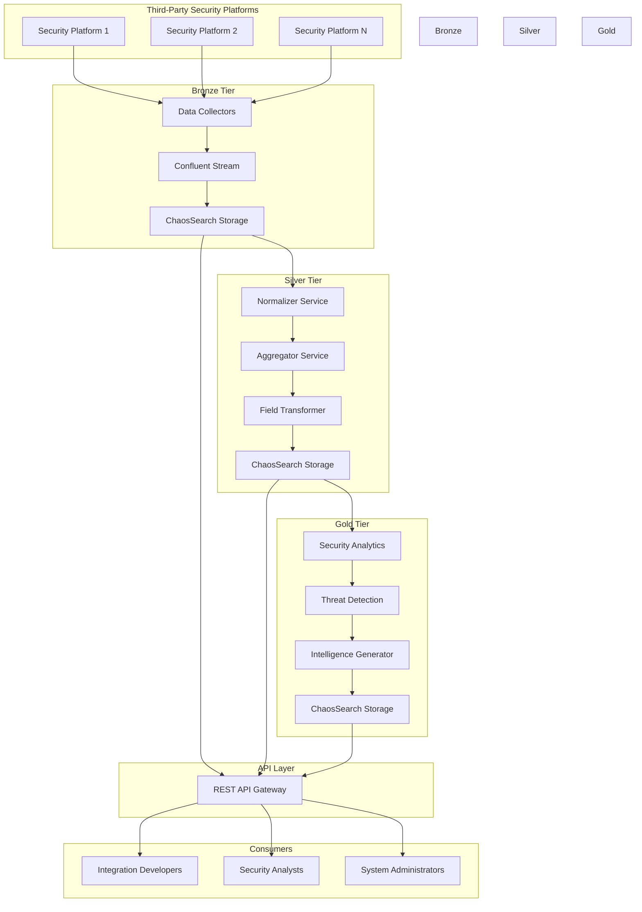
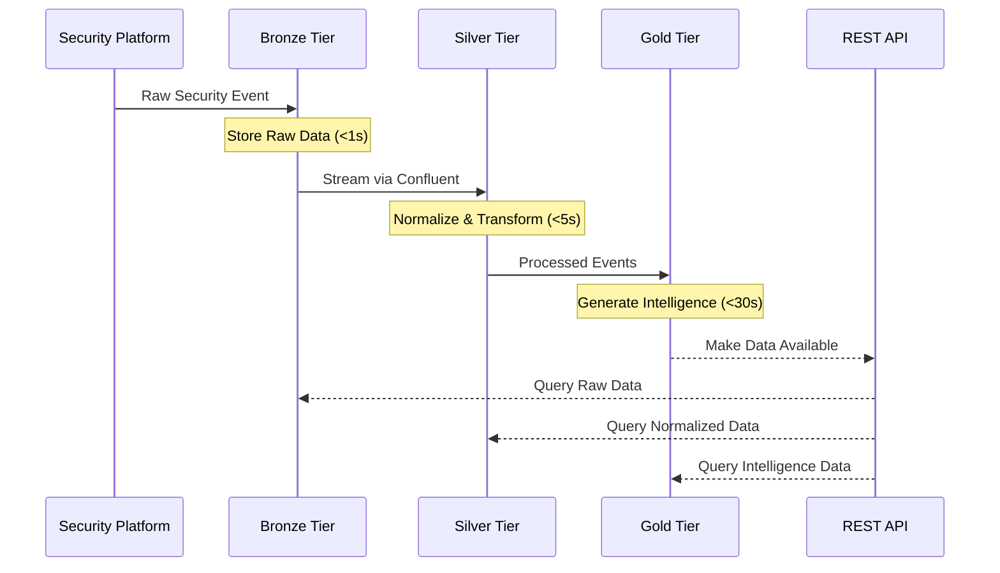
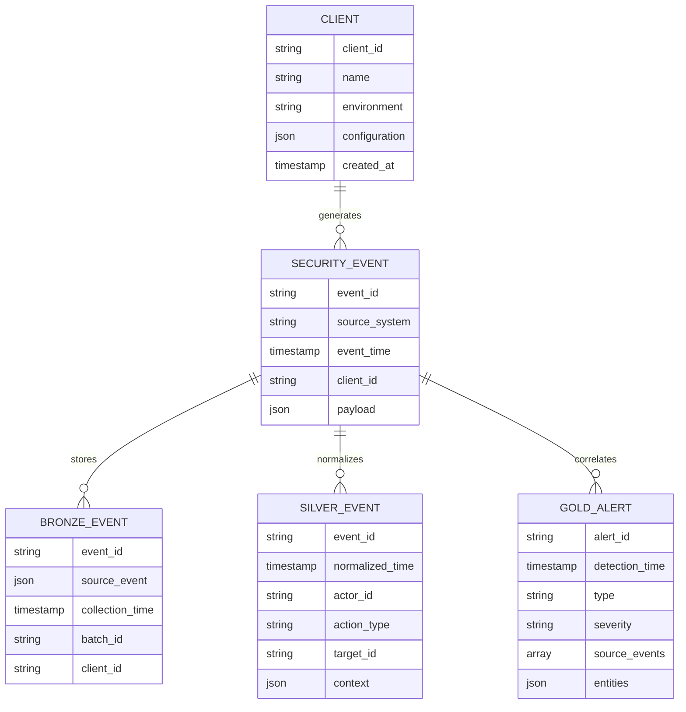
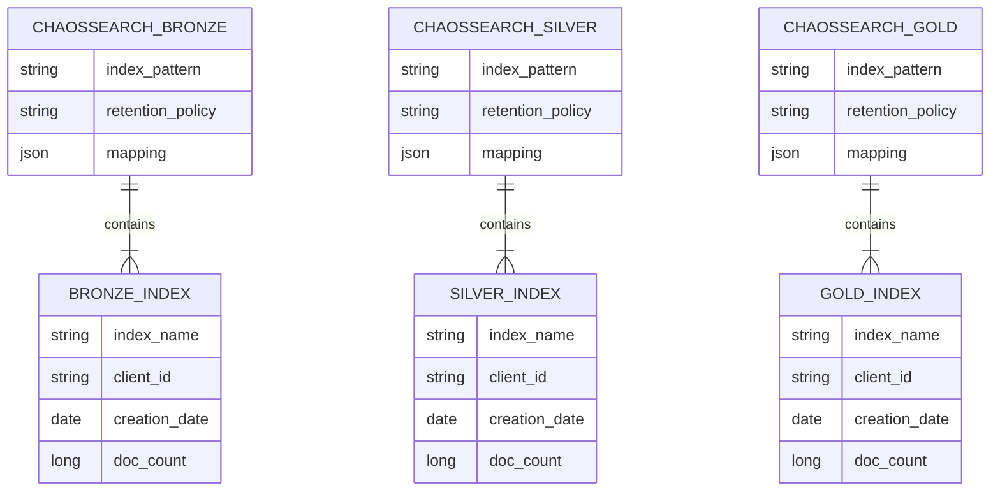
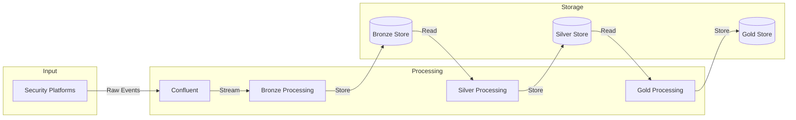

# Product Requirements Document (PRD)

# 1. INTRODUCTION

## 1.1 Purpose

This Software Requirements Specification (SRS) document provides a comprehensive description of the BlackPoint Security Integration Framework. It serves as the primary reference for technical teams, stakeholders, and integration partners by detailing functional specifications, system architecture, and implementation requirements. The document aims to ensure alignment between business objectives and technical implementation while providing clear guidelines for development and deployment.

## 1.2 Scope

The BlackPoint Security Integration Framework is a scalable data ingestion and processing system designed to streamline the integration of third-party security platforms. The system encompasses:

- Data collection and ingestion from multiple security platforms
- Three-tier data processing architecture (Bronze, Silver, Gold)
- Real-time event streaming and processing
- Standardized data transformation and normalization
- Security intelligence and threat detection capabilities
- REST API interfaces for data access and integration
- Multi-tenant architecture supporting concurrent clients
- Kubernetes-based deployment with Confluent and ChaosSearch infrastructure

Key benefits include:
- Reduced integration development time from 6-8 weeks to 2 weeks
- Increased integration capacity from 10 to 30+ integrations annually
- Standardized approach to security data processing
- Improved scalability and maintainability
- Enhanced security monitoring capabilities
- Reduced development and maintenance costs

The framework specifically excludes:
- End-user interface development
- Custom reporting tools
- Third-party platform modifications
- Security incident response procedures
- Client-specific security rules and policies

# 2. PRODUCT DESCRIPTION

## 2.1 Product Perspective
The BlackPoint Security Integration Framework operates as a core component within BlackPoint Cyber's broader security monitoring ecosystem. The framework interfaces with:

- Third-party security platforms via their respective APIs
- BlackPoint's existing security monitoring infrastructure
- Client-specific security tools and systems
- Kubernetes container orchestration platform
- Confluent event streaming platform
- ChaosSearch data storage and analytics platform

The system maintains a microservices architecture deployed on Kubernetes with clear separation between data collection, processing, and analysis layers through the Bronze, Silver, and Gold tier architecture.

## 2.2 Product Functions
- Security data ingestion from multiple third-party platforms
- Real-time event streaming and processing through Confluent
- Data normalization and standardization in the Silver tier
- Security intelligence generation in the Gold tier
- REST API exposure for data access and integration
- Multi-tenant data processing and storage
- Automated data transformation through processing tiers
- Security event correlation and threat detection
- Client-specific data retention and access management
- Audit logging and compliance tracking

## 2.3 User Characteristics

### Integration Developers
- Technical expertise: High
- Primary activities: Developing new platform integrations
- Requirements: Knowledge of REST APIs, data transformation, security protocols

### Security Analysts
- Technical expertise: Medium to High
- Primary activities: Monitoring security events, investigating threats
- Requirements: Understanding of security concepts, data analysis skills

### System Administrators
- Technical expertise: High
- Primary activities: System deployment, maintenance, monitoring
- Requirements: Kubernetes, Confluent, and ChaosSearch expertise

## 2.4 Constraints
- Must process data within specified latency requirements (Bronze: <1s, Silver: <5s, Gold: <30s)
- Limited to supported security platform APIs and protocols
- Must maintain data isolation between clients
- Required to operate within existing Kubernetes infrastructure
- Must comply with security and privacy regulations
- Integration development timeframe limited to 2 weeks
- Resource utilization must support 100+ concurrent clients

## 2.5 Assumptions and Dependencies
### Assumptions
- Third-party platforms provide stable API access
- Clients maintain consistent network connectivity
- Security platforms provide accurate timestamp information
- Data volumes remain within projected ranges
- Client systems support required authentication methods

### Dependencies
- Kubernetes cluster availability and performance
- Confluent platform stability
- ChaosSearch system uptime and performance
- Third-party API availability
- Network bandwidth and latency
- Client-provided authentication credentials
- Security platform version compatibility

# 3. PROCESS FLOWCHART





# 4. FUNCTIONAL REQUIREMENTS

## 4.1 Data Collection Features

### F1: Security Platform Authentication
**ID**: F1  
**Description**: Authenticate and maintain secure connections with third-party security platforms  
**Priority**: High  

| Requirement ID | Description | Acceptance Criteria |
|---------------|-------------|-------------------|
| F1.1 | Support multiple authentication methods (OAuth2, API Keys, Basic Auth) | Successfully authenticate with all supported security platforms |
| F1.2 | Securely store authentication credentials in Kubernetes secrets | Credentials encrypted at rest and in transit |
| F1.3 | Handle token refresh and session management | Automatic token renewal before expiration |
| F1.4 | Implement retry logic for failed authentication attempts | Maximum 3 retries with exponential backoff |
| F1.5 | Monitor authentication status and report failures | Alert on authentication failures within 30 seconds |

### F2: Real-time Event Collection
**ID**: F2  
**Description**: Collect and ingest security events in real-time from integrated platforms  
**Priority**: High  

| Requirement ID | Description | Acceptance Criteria |
|---------------|-------------|-------------------|
| F2.1 | Maintain persistent connections for real-time data streams | Event collection latency <1s |
| F2.2 | Handle API rate limiting and throttling | No data loss due to rate limiting |
| F2.3 | Support multiple collection methods (webhooks, polling, streaming) | Successfully collect data from all supported methods |
| F2.4 | Implement event deduplication | Zero duplicate events in Bronze tier |
| F2.5 | Preserve event ordering | Maintain chronological sequence of events |

## 4.2 Data Processing Features

### F3: Data Transformation Pipeline
**ID**: F3  
**Description**: Transform and normalize security data through the three-tier architecture  
**Priority**: High  

| Requirement ID | Description | Acceptance Criteria |
|---------------|-------------|-------------------|
| F3.1 | Transform raw data to Silver tier schema | 100% compliance with Silver tier schema |
| F3.2 | Normalize timestamps to UTC ISO8601 | Zero timestamp formatting errors |
| F3.3 | Aggregate related events in Silver tier | Correct event correlation within 5s |
| F3.4 | Generate security intelligence in Gold tier | Intelligence generation within 30s |
| F3.5 | Maintain data lineage across tiers | Complete traceability of data transformations |

### F4: Stream Processing
**ID**: F4  
**Description**: Process security events through Confluent streaming platform  
**Priority**: High  

| Requirement ID | Description | Acceptance Criteria |
|---------------|-------------|-------------------|
| F4.1 | Stream events through Confluent topics | Zero message loss during streaming |
| F4.2 | Support parallel processing of events | Process 1000+ events/second per client |
| F4.3 | Implement dead letter queues for failed processing | Failed events properly captured and logged |
| F4.4 | Enable stream replay capabilities | Successfully reprocess historical data |
| F4.5 | Monitor stream processing health | Real-time visibility into stream status |

## 4.3 Data Access Features

### F5: REST API Interface
**ID**: F5  
**Description**: Provide REST API access to security data across all tiers  
**Priority**: High  

| Requirement ID | Description | Acceptance Criteria |
|---------------|-------------|-------------------|
| F5.1 | Implement CRUD operations for all tiers | All API endpoints functional and documented |
| F5.2 | Support filtering and pagination | Efficient query performance with large datasets |
| F5.3 | Enable real-time data access | API response time <100ms |
| F5.4 | Implement rate limiting and quotas | Proper throttling of API requests |
| F5.5 | Provide API versioning | Backward compatibility maintained |

### F6: Multi-tenant Data Management
**ID**: F6  
**Description**: Manage data isolation and access control for multiple clients  
**Priority**: High  

| Requirement ID | Description | Acceptance Criteria |
|---------------|-------------|-------------------|
| F6.1 | Enforce client data isolation | Zero cross-client data access |
| F6.2 | Implement role-based access control | Proper enforcement of access permissions |
| F6.3 | Support client-specific retention policies | Automatic data retention enforcement |
| F6.4 | Enable client-specific configurations | Successful client customization |
| F6.5 | Track client resource usage | Accurate client usage metrics |

# 5. NON-FUNCTIONAL REQUIREMENTS

## 5.1 Performance Requirements

| Requirement | Description | Target Metric |
|-------------|-------------|---------------|
| Response Time | Maximum latency for data processing through tiers | Bronze: <1s, Silver: <5s, Gold: <30s |
| API Performance | REST API endpoint response time | <100ms for 95th percentile |
| Throughput | Event processing capacity per client | >1000 events/second |
| Resource Usage | Maximum resource utilization | CPU: 80%, Memory: 75%, Storage: 85% |
| Concurrent Users | Simultaneous client support | 100+ active clients |
| Stream Processing | Confluent message processing delay | <500ms end-to-end |
| Query Performance | ChaosSearch data retrieval time | <3s for complex queries |

## 5.2 Safety Requirements

| Requirement | Description | Implementation |
|-------------|-------------|----------------|
| Data Backup | Regular backup of all tier data | Daily incremental, Weekly full backup |
| Failure Recovery | System recovery after component failure | Auto-recovery within 5 minutes |
| Data Consistency | Maintain data integrity across tiers | Transaction logging and validation |
| Circuit Breaking | Prevent cascade failures | Automatic circuit breaking at 80% threshold |
| Graceful Degradation | Maintain core functions during partial failure | Fallback to essential services |
| State Management | Preserve system state during failures | Persistent state storage in ChaosSearch |
| Error Handling | Comprehensive error management | Structured error logging and alerting |

## 5.3 Security Requirements

| Requirement | Description | Implementation |
|-------------|-------------|----------------|
| Authentication | Multi-factor authentication for system access | OAuth2.0 with MFA |
| Authorization | Role-based access control (RBAC) | Kubernetes RBAC integration |
| Data Encryption | Encryption for data at rest and in transit | TLS 1.3, AES-256 encryption |
| Audit Logging | Comprehensive security event logging | Detailed audit trails in ChaosSearch |
| Access Control | Fine-grained access management | Client-level permission controls |
| Secrets Management | Secure credential storage | Kubernetes Secrets integration |
| Network Security | Network isolation and protection | Network policies and segmentation |

## 5.4 Quality Requirements

### 5.4.1 Availability
- System uptime: 99.9% excluding planned maintenance
- Maximum planned downtime: 4 hours per month
- Automatic failover within 30 seconds
- No single point of failure in architecture

### 5.4.2 Maintainability
- Modular architecture with clear separation of concerns
- Automated deployment through CI/CD pipelines
- Comprehensive system documentation
- Monitoring and alerting infrastructure

### 5.4.3 Usability
- REST API with OpenAPI 3.0 documentation
- Consistent error messages and status codes
- Clear logging and debugging information
- Integration guides and examples

### 5.4.4 Scalability
- Horizontal scaling of all components
- Auto-scaling based on load metrics
- Resource quotas per client
- Linear performance scaling with load

### 5.4.5 Reliability
- Data durability: 99.999%
- Maximum data loss window: 5 minutes
- Automated health checks and self-healing
- Fault tolerance across availability zones

## 5.5 Compliance Requirements

| Requirement | Description | Implementation |
|-------------|-------------|----------------|
| Data Privacy | GDPR and CCPA compliance | Data classification and handling procedures |
| Data Retention | Client-specific retention policies | Automated data lifecycle management |
| Audit Requirements | SOC 2 Type II compliance | Continuous compliance monitoring |
| Industry Standards | ISO 27001 certification | Security controls framework |
| Data Sovereignty | Regional data storage compliance | Geo-specific data storage options |
| Access Controls | Principle of least privilege | Regular access reviews and updates |
| Reporting | Compliance reporting capabilities | Automated compliance reporting |

# 6. DATA REQUIREMENTS

## 6.1 Data Models

### 6.1.1 Logical Data Model



### 6.1.2 Physical Data Storage Model



## 6.2 Data Storage

### 6.2.1 Storage Requirements

| Tier | Storage Type | Retention Period | Backup Frequency | Replication Factor |
|------|--------------|------------------|------------------|-------------------|
| Bronze | ChaosSearch/S3 | 30 days | Daily | 3 |
| Silver | ChaosSearch/S3 | 90 days | Daily | 3 |
| Gold | ChaosSearch/S3 | 365 days | Daily | 3 |

### 6.2.2 Data Redundancy
- Cross-availability zone replication within ChaosSearch
- S3 standard storage with 99.999999999% durability
- Real-time data replication across three availability zones
- Automated failover for high availability

### 6.2.3 Backup and Recovery
- Daily incremental backups of all tiers
- Weekly full backups stored in separate S3 bucket
- Point-in-time recovery capability up to 7 days
- Maximum recovery time objective (RTO): 4 hours
- Recovery point objective (RPO): 15 minutes

## 6.3 Data Processing

### 6.3.1 Data Flow



### 6.3.2 Data Security Controls

| Layer | Security Control | Implementation |
|-------|-----------------|----------------|
| Ingestion | TLS Encryption | TLS 1.3 for all data in transit |
| Processing | Field-level Encryption | AES-256 for sensitive fields |
| Storage | Server-side Encryption | S3 SSE with KMS |
| Access | Client Isolation | Namespace-level segregation |
| Backup | Encrypted Backups | KMS-managed encryption keys |
| API | Authentication | OAuth2.0 with JWT tokens |

### 6.3.3 Data Transformation Rules

| Tier | Transformation Type | Latency SLA |
|------|-------------------|-------------|
| Bronze | Raw data preservation | <1s |
| Silver | Field normalization, timestamp standardization | <5s |
| Gold | Event correlation, threat detection | <30s |

# 7. EXTERNAL INTERFACES

## 7.1 Software Interfaces

### 7.1.1 Third-Party Security Platforms

| Interface | Protocol | Data Format | Authentication |
|-----------|----------|-------------|----------------|
| REST APIs | HTTPS | JSON/XML | OAuth2.0, API Keys |
| Webhooks | HTTPS | JSON | HMAC Signatures |
| Event Streams | WebSocket | JSON | JWT Tokens |
| SIEM Systems | Syslog, TCP/UDP | CEF, LEEF | TLS Certificates |

### 7.1.2 Infrastructure Services

| Service | Interface Type | Purpose | Requirements |
|---------|---------------|----------|--------------|
| Confluent | Kafka Protocol | Event streaming | SASL/SCRAM authentication |
| ChaosSearch | REST API | Data storage | IAM authentication |
| Kubernetes API | REST API | Orchestration | Service accounts, RBAC |
| Elasticsearch API | REST API | Data querying | API keys, TLS |

## 7.2 Communication Interfaces

### 7.2.1 Network Protocols

| Protocol | Port | Usage | Security |
|----------|------|-------|----------|
| HTTPS | 443 | API communication | TLS 1.3 |
| TCP | 9092 | Confluent streams | TLS encryption |
| TCP | 9200 | Elasticsearch API | TLS encryption |
| TCP | 6443 | Kubernetes API | mTLS |

### 7.2.2 Data Exchange Formats

| Format | Schema Version | Validation | Usage |
|--------|---------------|------------|--------|
| JSON | JSON Schema Draft-07 | Runtime validation | API payloads |
| Avro | 1.11.0 | Schema registry | Stream messages |
| Protocol Buffers | proto3 | Compile-time | Internal services |
| JWT | RFC 7519 | RS256 signature | Authentication |

### 7.2.3 Integration Endpoints

| Endpoint Type | Rate Limit | Timeout | Retry Policy |
|---------------|------------|---------|--------------|
| Collection APIs | 1000 req/min | 30s | Exponential backoff |
| Query APIs | 100 req/min | 60s | Maximum 3 retries |
| Streaming | 10MB/s | N/A | Auto-reconnect |
| Webhook delivery | 100 req/min | 5s | Queue-based retry |

## 7.3 Hardware Interfaces

### 7.3.1 Infrastructure Requirements

| Component | Specification | Scaling | Redundancy |
|-----------|--------------|---------|------------|
| Load Balancers | AWS NLB | Auto-scaling | Multi-AZ |
| Network Interface | 10Gbps | N/A | Redundant NICs |
| Storage Interface | AWS EBS/S3 | Dynamic provisioning | Cross-region |
| Container Runtime | containerd | Horizontal | Node pools |

### 7.3.2 Resource Requirements

| Resource | Minimum | Recommended | Maximum |
|----------|---------|-------------|---------|
| CPU | 4 cores/node | 8 cores/node | 16 cores/node |
| Memory | 16GB/node | 32GB/node | 64GB/node |
| Network | 1Gbps | 10Gbps | 25Gbps |
| Storage IOPS | 3000 | 10000 | 20000 |

## 7.4 API Interfaces

### 7.4.1 REST API Specifications

```yaml
openapi: 3.0.0
paths:
  /api/v1/events:
    get:
      parameters:
        - name: tier
          in: query
          required: true
          schema:
            type: string
            enum: [bronze, silver, gold]
        - name: client_id
          in: header
          required: true
          schema:
            type: string
    post:
      requestBody:
        required: true
        content:
          application/json:
            schema:
              $ref: '#/components/schemas/Event'
```

### 7.4.2 API Authentication

| Method | Token Type | Expiration | Scope |
|--------|------------|------------|-------|
| OAuth2.0 | Bearer | 1 hour | read:events, write:events |
| API Keys | Static | N/A | client-specific |
| mTLS | Certificate | 90 days | system-wide |
| HMAC | Signature | Per request | webhook verification |

# 8. APPENDICES

## 8.1 GLOSSARY

| Term | Definition |
|------|------------|
| Bronze Tier | The initial data storage layer that preserves raw security events exactly as received from source systems |
| Silver Tier | The normalization and processing layer that transforms raw events into a standardized schema |
| Gold Tier | The intelligence layer that generates security insights and alerts from processed data |
| Integration Framework | A standardized system for connecting third-party security platforms to BlackPoint's monitoring infrastructure |
| Client Isolation | The practice of keeping each client's data separate and secure from other clients |
| Data Lineage | The ability to track data's complete journey through the system from source to final state |
| Dead Letter Queue | A storage mechanism for messages that fail to be processed successfully |

## 8.2 ACRONYMS

| Acronym | Definition |
|---------|------------|
| API | Application Programming Interface |
| CRUD | Create, Read, Update, Delete |
| GDPR | General Data Protection Regulation |
| CCPA | California Consumer Privacy Act |
| HMAC | Hash-based Message Authentication Code |
| IAM | Identity and Access Management |
| JWT | JSON Web Token |
| KMS | Key Management Service |
| LEEF | Log Event Extended Format |
| MFA | Multi-Factor Authentication |
| mTLS | Mutual Transport Layer Security |
| NIC | Network Interface Card |
| RBAC | Role-Based Access Control |
| RPO | Recovery Point Objective |
| RTO | Recovery Time Objective |
| SASL | Simple Authentication and Security Layer |
| SCRAM | Salted Challenge Response Authentication Mechanism |
| SIEM | Security Information and Event Management |
| SLA | Service Level Agreement |
| SSE | Server-Side Encryption |
| TLS | Transport Layer Security |

## 8.3 ADDITIONAL REFERENCES

| Reference | Description | URL |
|-----------|-------------|-----|
| Confluent Documentation | Official documentation for Confluent platform | https://docs.confluent.io |
| ChaosSearch Documentation | Official documentation for ChaosSearch | https://docs.chaossearch.io |
| Kubernetes Documentation | Official Kubernetes documentation | https://kubernetes.io/docs |
| OpenAPI Specification | REST API documentation standard | https://spec.openapis.org/oas/v3.0.0 |
| NIST Cybersecurity Framework | Security standards and guidelines | https://www.nist.gov/cyberframework |
| ISO 27001 Standard | Information security management standard | https://www.iso.org/isoiec-27001-information-security.html |
| SOC 2 Compliance | Security compliance framework | https://www.aicpa.org/soc |
| AWS S3 Documentation | Amazon S3 storage service documentation | https://docs.aws.amazon.com/s3 |